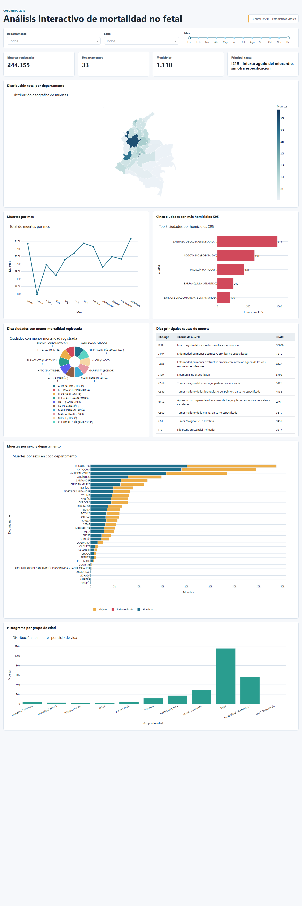

# Analisis interactivo de mortalidad en Colombia 2019

## Estudiantes de la maestría en Inteligencia Articial
- Carlos Enrique Jiménez Avendaño
- Gustavo Alberto Guerrero Polanco
- Osman Eduardo Angulo Lozano

## Sobre la aplicación web

Aplicacion web desarrollada con Python, Dash y Plotly para explorar los registros de mortalidad no fetal en Colombia durante 2019. El proyecto usa los anexos del DANE, la codificacion CIE-10 de causas de muerte, la division politico-administrativa DIVIPOLA y un archivo GeoJSON de departamentos.



## Objetivo

Analizar patrones regionales, temporales, demograficos y causales de mortalidad en Colombia para 2019 mediante un dashboard interactivo. La aplicacion permite filtrar por departamento, sexo y rango de meses, actualizando dinamicamente los indicadores, graficos y tabla.

## Estructura del proyecto

```text
.
|-- app.py
|-- config.py
|-- requirements.txt
|-- Procfile
|-- render.yaml
|-- runtime.txt
|-- data/
|   |-- Anexo1.NoFetal2019_CE_15-03-23.xlsx
|   |-- Anexo2.CodigosDeMuerte_CE_15-03-23.xlsx
|   |-- Divipola_CE_.xlsx
|   |-- Colombia.geo.json
|-- models/
|   |-- age_groups.py
|   |-- analytics.py
|   |-- data_loader.py
|-- controllers/
|   |-- callbacks.py
|   |-- dashboard_state.py
|-- views/
|   |-- figures.py
|   |-- layout.py
|-- assets/
|   |-- styles.css
|-- docs/
|   |-- screenshots/
|       |-- dashboard.png
|-- scripts/
    |-- run_local.py
```

## Requisitos

- Python 3.12
- Dash
- Plotly
- Pandas
- OpenPyXL
- Gunicorn, para despliegue en Linux/Render

Las versiones compatibles estan definidas en `requirements.txt`.

## Instalacion local

```bash
git clone https://github.com/caliche18a/Actividad_4
cd Actividad_4
python -m venv .venv
.venv\Scripts\activate
pip install -r requirements.txt
python app.py
```

En Windows, si el puerto 8050 esta ocupado, puede ejecutarse:

```bash
set PORT=3000
python scripts/run_local.py
```

## Despliegue y repositorio

La aplicación fue desarrollada localmente utilizando Python, Dash y Plotly, posteriormente versionada y cargada en un repositorio de GitHub para control de versiones y automatización del despliegue.

El despliegue en producción se realizó sobre Microsoft Azure App Service utilizando una cuenta institucional universitaria de la Universidad de La Salle. La integración continua se configuró conectando el repositorio de GitHub directamente con Azure para automatizar las implementaciones.

## Software utilizado

- Python para procesamiento de datos.
- Pandas y OpenPyXL para lectura y transformacion de archivos Excel.
- Plotly Graph Objects para las visualizaciones interactivas.
- Dash para la aplicacion web.
- HTML/CSS en `assets/styles.css` para presentacion visual.
- Gunicorn para servir la app en PaaS.

## Visualizaciones y resultados

- Mapa por departamento: Bogota D.C., Antioquia y Valle del Cauca concentran los mayores totales de muertes registradas en 2019.
- Linea mensual: diciembre registra el mayor total mensual, con 21.678 muertes; febrero es el mes mas bajo, con 17.974.
- Barras de homicidios X95: Santiago de Cali lidera los homicidios por agresion con disparo de otras armas de fuego y no especificadas, con 971 casos; le siguen Bogota D.C. y Medellin.
- Grafico circular: muestra los municipios con menor mortalidad registrada en el archivo, todos con 1 caso dentro del periodo analizado.
- Tabla de causas: la primera causa es `I219`, infarto agudo del miocardio sin otra especificacion, con 35.088 casos.
- Barras apiladas por sexo: en la mayoria de departamentos el total masculino supera al femenino, con los mayores volumenes en Bogota D.C., Antioquia y Valle del Cauca.
- Histograma por edad: la vejez concentra el mayor volumen de defunciones, seguida por longevidad/centenarios.

## Datos de entrega

- Integrantes: 
### Carlos Enrique Jiménez Avendaño
### Gustavo Alberto Guerrero Polanco
### Osman Eduardo Angulo Lozano

- URL de la aplicacion desplegada: [completar despues del despliegue.](https://actividad-4-awgsc0ezgvhxdua8.canadacentral-01.azurewebsites.net/)
- URL del repositorio en GitHub: https://github.com/caliche18a/Actividad_4
